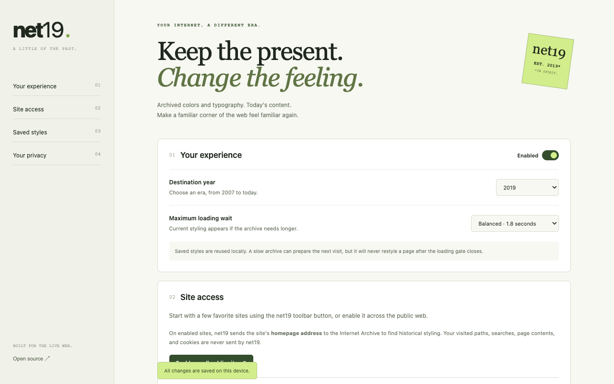

# net19

**The live web, with a little of its past.**

Net19 is a Chrome extension that adapts archived website colors and typography to the site you're visiting today. Choose a year from **2007 to the current year**; the default is **2019**. Today's content, links, and controls stay in place.

[Download net19 0.1.0](https://github.com/henry-xli/net19/raw/refs/heads/main/downloads/net19-0.1.0.zip) · [Privacy policy](PRIVACY.md) · [Architecture](docs/ARCHITECTURE.md) · [Store submission guide](docs/CHROME_WEB_STORE.md)



## Install in Chrome

1. Download and extract the ZIP above.
2. Open `chrome://extensions`, turn on **Developer mode**, and select **Load unpacked**.
3. Select the extracted directory containing `manifest.json`.
4. Open a website, click net19, and select **Enable on this site**. Alternatively, use Settings to enable it on all public sites.
5. Choose a year. **Prepare next visit** looks for a style without changing your open page. It will be used on the next normal navigation if ready.

This is an unpacked release, not a Chrome Web Store installation. Net19 never reloads a tab for you. The first already-open page is left as it is when you grant access.

## How it behaves

- **Before the page is revealed:** a small, opaque loading gate covers the live page while styling is prepared. Chrome loads the live site concurrently; extensions cannot pause the entire network navigation while doing arbitrary archive analysis.
- **Fast cache path:** an existing profile is read from local storage and inserted while inactive. Its activation and gate removal happen together. A browser test checks that no visible frame contains the current theme before a cached historical theme.
- **Bounded waiting:** the default wait is 1.8 seconds, configurable up to 2.2 seconds. A separate CSS fallback stops the gate after 2.4 seconds even if JavaScript cleanup fails. This bounds the added reveal delay under normal browser scheduling; it cannot bound a site's own network load or a frozen browser renderer.
- **No late restyle:** once revealed, the document can no longer activate an archive response. Slow lookups may warm the next visit's cache for up to 14 seconds. No navigation, tab reload, or live-content replacement is performed.
- **100 saved profiles:** the most recently used site/year profiles are kept locally, within a 4 MiB budget. Related pages on the same origin reuse one homepage-derived profile. Full archived pages are never cached by net19.
- **Older or current fallback:** the Wayback CDX and Availability indexes are checked for the selected year. An older result is used if a usable selected-year capture isn't found within the bounded search. Invalid, unavailable, newer, or incompatible captures leave the current site in place.
- **Local analysis:** HTML and CSS are parsed in the extension worker. There is no net19 server, remote AI, telemetry, account, or API key.

## What “historical styling” means

Net19 extracts a conservative theme: document colors, local font equivalents, readable typography, headings, and compatible plain links/buttons. It does **not** recreate a site's historical DOM, move modern controls into an old layout, replace live pages with archive pages, or guarantee an exact visual reconstruction. Old CSS and today's markup often have little in common; an unusable theme falls back to the current site instead of pretending to reproduce the past.

The current-year setting uses the live site's existing style. Complex app surfaces, custom elements, shadow roots, frames, canvas content, classed controls, conditional themes, and webfonts may retain their current appearance. Private/IP/local addresses, browser pages, the extension store, archive sites, and incognito are excluded.

Wayback is the implemented provider. Archive.is is not queried; no unofficial API, captcha bypass, proxy, or site submission service is used. Archive availability is independent of net19. A live validation obtained Python.org's July 2019 styling in approximately three seconds; other probes encountered timeouts or unusable captures. Deterministic real-Chromium tests separately exercise archive lookup, CSS extraction, cold/cached navigation, and fallback using controlled archive responses. See [validation](docs/VALIDATION.md) for the scope of that evidence.

## Privacy and control

Site access is optional. Before enabling a site, the UI explains that its **public homepage origin** is shared with the Internet Archive. Net19 never sends the visited path, query, fragment, page contents, form fields, or cookies. It does not inspect current page contents to find a snapshot.

Profiles store a public site origin, selected/capture year, source snapshot address, extracted CSS, and creation/last-used times locally. See the [privacy policy](PRIVACY.md). Pause a site or all sites to restore current styling immediately. Year changes take effect on the next navigation. Clear the cache in Settings; in-flight jobs cannot refill a cleared cache.

## Build and verify

Requires Node.js 22 or newer; CI uses Node 24.

```sh
npm ci
npx playwright install chromium
npm run check
npm run package
```

- `dist/extension/`: the unpacked production extension.
- `artifacts/net19-0.1.0.zip`: the deterministic, store-uploadable ZIP, with a SHA-256 file alongside it.
- `npm run check:archive`: optional live Wayback probe. Exit 1 means no usable live profile was obtained; it is intentionally not a deterministic CI gate.

The browser tests load the production bundle into real Chromium. Their isolated test manifest grants two fictional fixture origins; those permissions and fixtures are **not** included in the shipping ZIP. Build/package scripts use an explicit shipping file allowlist. No development server, browser profiles, environment files, screenshots of personal browsing, or test data belong in the package.

## Development

Source lives in `src/`, static interface/manifest files in `static/`, and tests in `tests/`. The worker bundles the HTML/CSS parsers; the content script is approximately 4 KB. Dependencies and redistribution licenses are included in the build. Build again after editing source; do not edit generated bundles.

MIT license. Net19 is independent of the Internet Archive and Retrofy.
